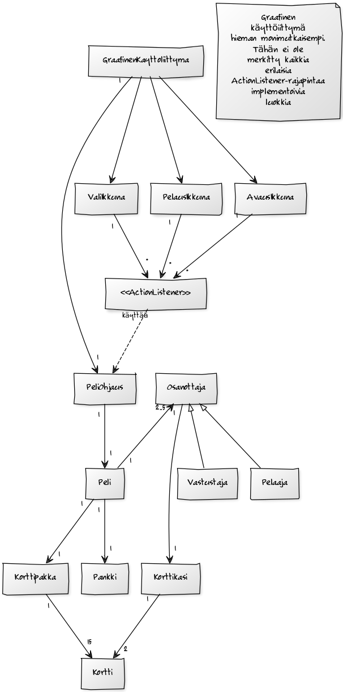

# Aihemäärittely
**Aihe**: Tietokonetoteutus vähemmän tunnetusta Coup-strategialautapelistä.
Coup on peli, jossa joukko pelaajia yrittää voittaa vallankumouksen.
Pelaajia on 2-5. Pelin alussa jokainen saa käyttöönsä kaksi korttia ja kaksi kolikkoa.
Jokaiseen korttiin liittyy hahmo, jolla on tiettyjä erityisominaisuuksia. Kortit eivät näy muille pelaajille.
Pelaajat voivat käyttää korttiensa erityisominaisuuksia tai yrittää huijata ja tällä tavoin voittaa muut pelaajat. Muut pelaajat voivat epäillä vuorossa olevan siirtoa.

Coupin tässä toteutuksessa yksi pelaaja pelaa valitsemaansa määrää (1-4) tekoälyjä vastaan.
Graafinen käyttöliittymä on olennainen osa ohjelmaan, sillä pelaajan pitää jokaisen siirtonsa aikana nähdä paitsi oma kätensä myös muiden pelaajien mahdollisesti paljastuneet kortit ja kentän tilanne.

**Käyttäjät**: Pelaaja.

**Pelaajan toiminnot**: 
* Aloita peli.
** Pelaaja voi valita nimensä ja vastustajien lukumäärän.
* Tee siirto.
** Pelaaja voi valita kohteen sekä siirron, jonka tekee.
* Epäile tai torju vastustaja siirto.

#Rakenne
Pelin logiikka-paketissa sijaitsevat itse pelin eri osatekijöitä kuvaavat oliot. Peli-luokka kuvaa
Coup-Peliä ja pitää sisällään pelaajan ja vastustajat, jotka laajentavat yläluokkaan Osanottaja,
korttipakan ja pankin. Osanottaja luokka kuvaa yleisellä tasolla yhtä pelin osanottajaa. Osanottajalla
on korttikäsi, luokan Korttikäsi olio, joka sisältään pelikortteja kuvaavia Kortti-olioita. Osanottajalla on myös rahaa ja nimi. Luokkaa laajentavat luokat Pelaaja ja Vastustaja, joista
Pelaaja-luokan oliot kuvaavat pelin uniikkia pelaajaa ja vastustajat ovat pelissä muuten esiintyvät osanottajat.

Graafinen käyttöliittymä vastaa käyttäjän ja pelin vuorovaikutuksesta. Käyttöliittymä-paketissa on useita erilaisia graafisia luokkia laajentavia komponentteja ja näitä kuuntelevia toiminnankuuntelijoita.  Graafinen käyttöliittymä pyörittää peliä osittain luokan PeliOhjaus avulla. PeliOhjaus-luokan olio luo pelin ja vastaa esimerkiksi pelin siirtojen kutsumisesta.
 
###Luokkakaaviot

# Käyttötapauksia
## Sekvenssikaaviot
### Pelin aloittaminen

### Siirron tekeminen

